# 2048 — Jeu mobile Android

Projet Android (Kotlin / Jetpack Compose) du célèbre jeu 2048, développé dans le cadre du cours **EU : Développement sous Smartphone** — 2025/2026.

---

## 📸 Captures d'écran

### Écran de jeu

| Thème Clair | Thème Sombre | Thème Coloré |
|:-----------:|:------------:|:------------:|
| 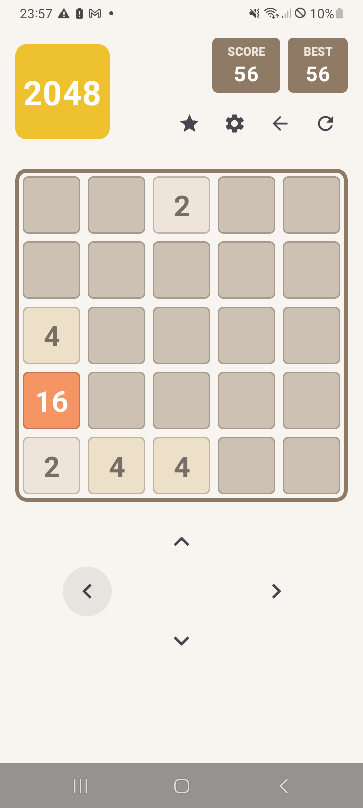 | 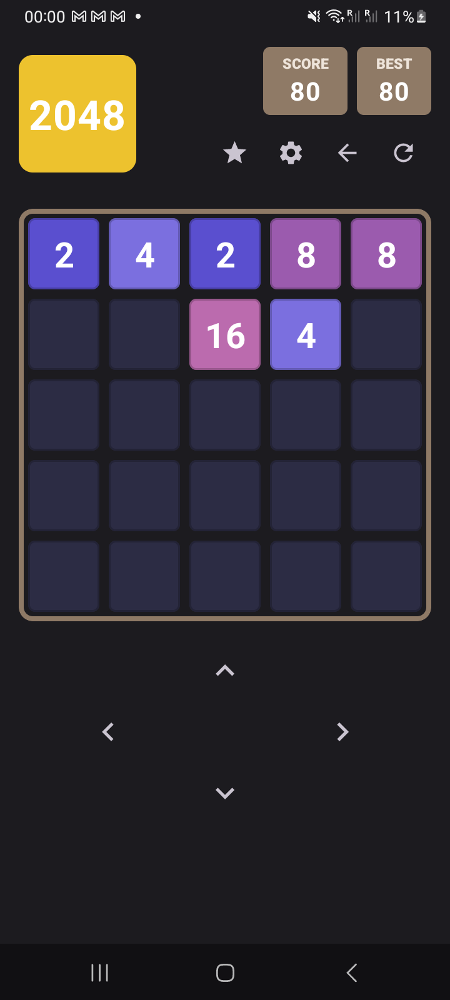 | 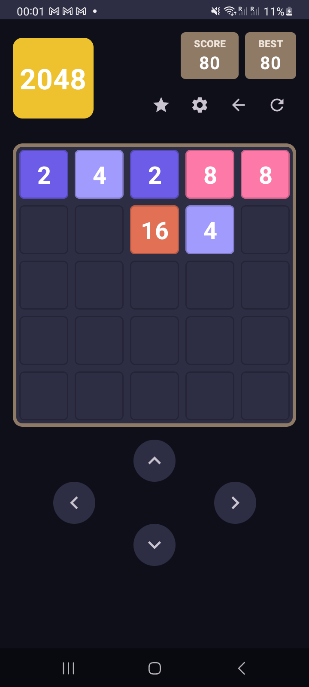 |

### Surbrillance directionnelle (ligne active pendant un glissement)

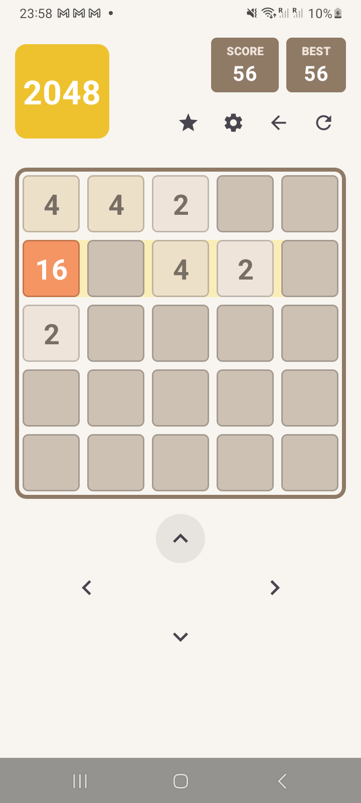

### Écran Paramètres

| Thème Clair | Thème Sombre | Thème Coloré |
|:-----------:|:------------:|:------------:|
| 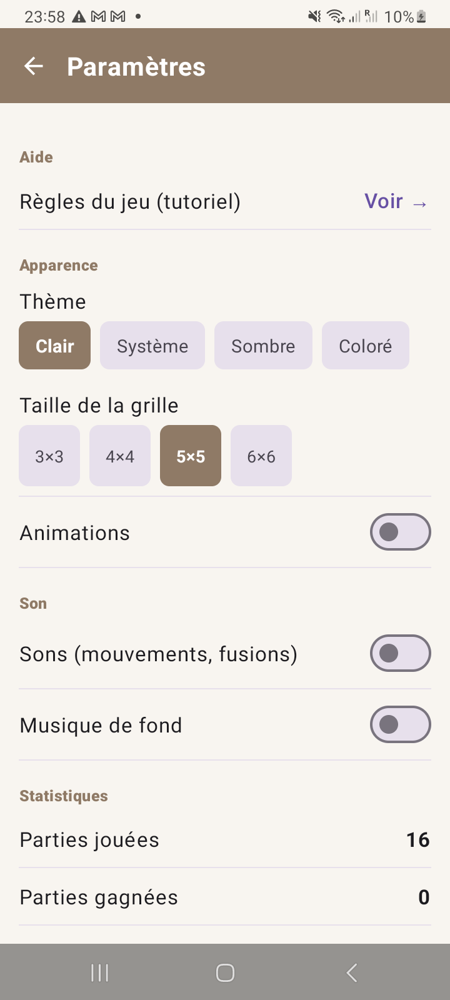 | 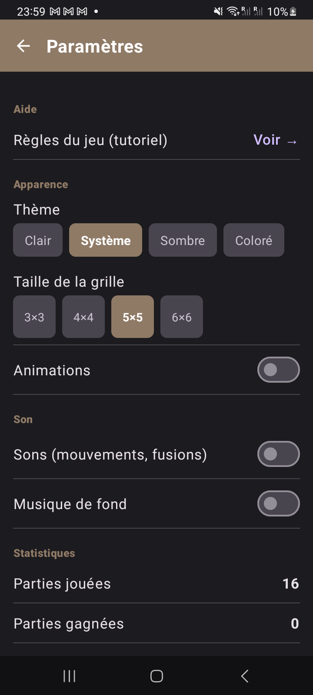 | 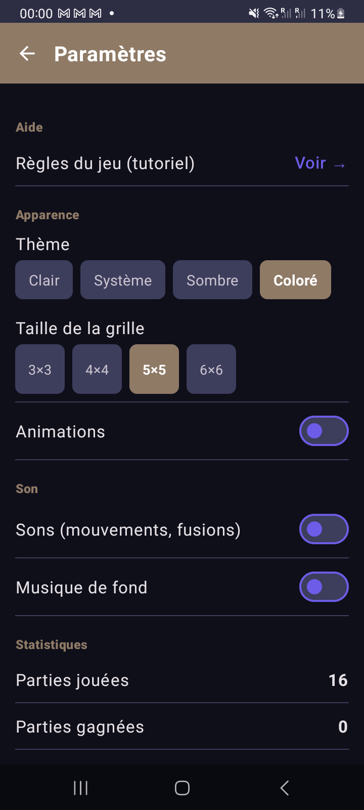 |

### Écran Classement (Meilleurs scores)

| Thème Clair | Thème Sombre |
|:-----------:|:------------:|
| 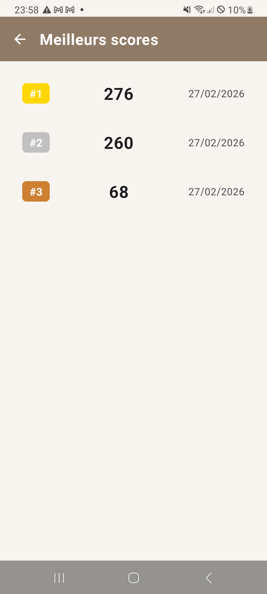 | 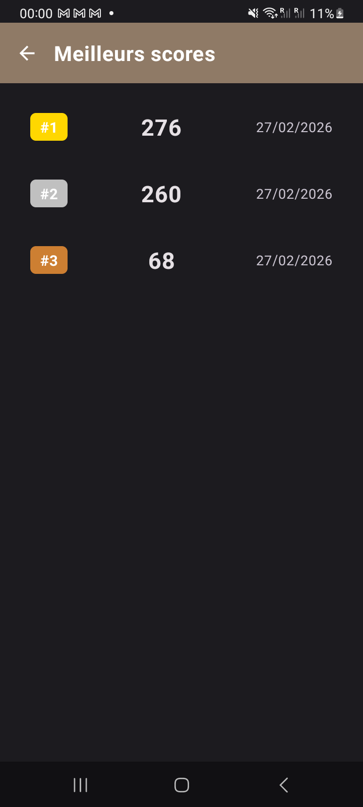 |

### Tutoriel ("Comment jouer")

| Thème Clair | Thème Sombre | Thème Coloré |
|:-----------:|:------------:|:------------:|
| 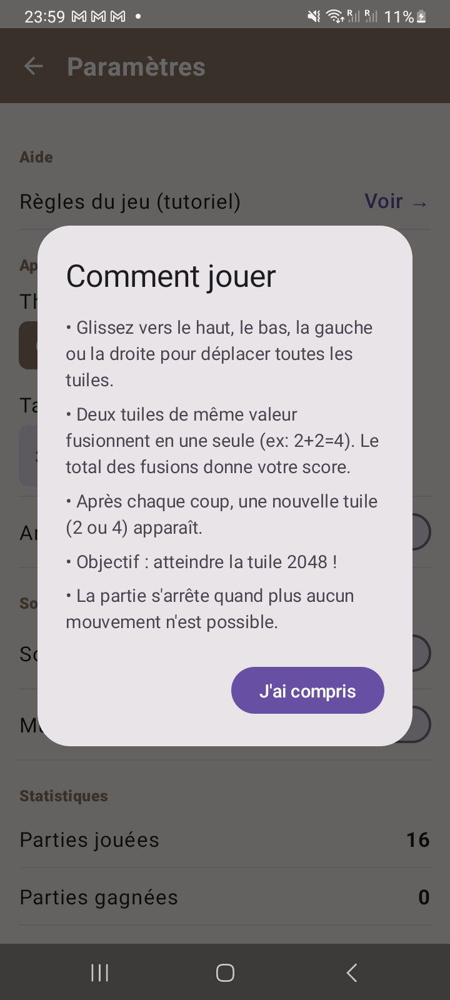 | 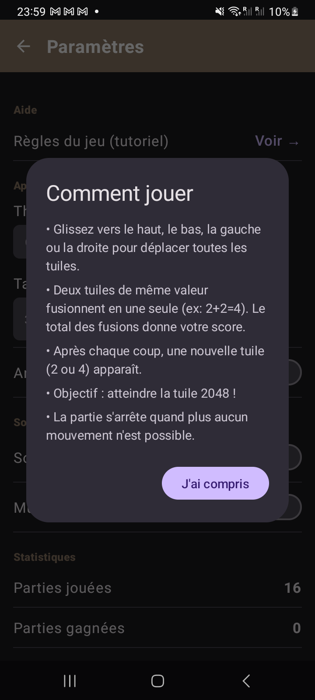 | 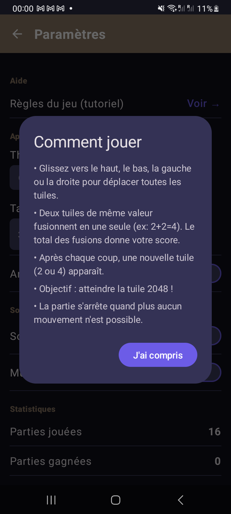 |

---

## 🚀 Ouvrir le projet

1. Ouvrir **Android Studio** (version récente avec support SDK 34+).
2. **File → Open** → sélectionner le dossier `Jeu_mobile`.
3. Laisser Android Studio synchroniser Gradle.
4. Si nécessaire : **File → Settings → Build → Gradle** → vérifier que le wrapper est utilisé.

## ▶️ Lancer l'application

- Brancher un appareil Android **(API 26+)** ou démarrer un émulateur.
- Cliquer sur **Run ▶** ou `Shift + F10`.

---

## ✅ Fonctionnalités implémentées

### Obligatoires
| Fonctionnalité | Détails |
|---|---|
| Jeu de base | Grille NxN (3×3 à 6×6), glissements tactiles, fusion des tuiles, score, victoire (2048), défaite |
| Sauvegarde / reprise | État de la grille et score enregistrés automatiquement (DataStore) |
| Tableau des scores | Meilleurs scores persistants (Room), classement avec médailles 🥇🥈🥉 |

### Optionnelles
| Fonctionnalité | Détails |
|---|---|
| Thèmes | Clair, Système (auto), Sombre, Coloré |
| Taille de grille | 3×3, 4×4, 5×5, 6×6 — changeable dans les Paramètres |
| Animations | Activation/désactivation des transitions |
| Sons | Son de déplacement (MP3) + musique de fond en boucle |
| Statistiques | Parties jouées, gagnées, perdues |
| Partage | Partage du score depuis la boîte de dialogue Game Over |
| Tutoriel | Règles du jeu (Paramètres → « Règles du jeu ») |
| Annuler | Bouton Undo (jusqu'à 10 coups en arrière) |
| Surbrillance directionnelle | La ligne/colonne active s'illumine en temps réel pendant un glissement |

---

## 📁 Structure du projet

```
app/src/main/kotlin/com/jeu2048/app/
├── game/
│   ├── GameEngine.kt       — Moteur de jeu (grille, déplacements, fusions, undo, état)
│   ├── GameState.kt        — Modèle de données pour la sauvegarde
│   └── Direction.kt        — Enum des 4 directions
├── data/
│   ├── GamePreferences.kt  — Préférences de jeu (DataStore)
│   ├── SettingsPreferences.kt — Paramètres utilisateur (DataStore)
│   ├── ScoreDao.kt         — Interface d'accès Room
│   ├── ScoreDatabase.kt    — Base de données Room
│   └── ScoreEntity.kt      — Entité Room (score + timestamp)
├── ui/
│   ├── GameViewModel.kt    — ViewModel (états, logique UI, sons)
│   ├── ShareHelper.kt      — Partage du score
│   ├── screens/
│   │   ├── GameScreen.kt   — Écran de jeu principal
│   │   ├── SettingsScreen.kt — Écran Paramètres
│   │   ├── ScoresScreen.kt — Écran Classement
│   │   └── TutorialDialog.kt — Dialogue tutoriel
│   └── theme/
│       ├── AppTheme.kt     — Thème Material3
│       └── Theme.kt        — Couleurs des tuiles (3 thèmes × 13 valeurs)
├── sound/
│   └── SoundManager.kt     — Gestion sons (SoundPool pour MP3 + MediaPlayer pour musique)
├── GameApplication.kt      — Application lifecycle
└── MainActivity.kt         — Navigation Compose (NavHost)

app/src/main/res/raw/
├── move.mp3                — Son de déplacement et de fusion
└── bg_music.mp3            — Musique de fond (boucle)
```

---

## 🎨 UI/UX

- Header "2048" en bloc doré, ScoreCards marron style officiel
- Grille avec bordure marron et bordures sur chaque tuile
- Surbrillance jaune-or en temps réel sur la ligne/colonne touchée
- Boutons flèches animés (cercle qui s'illumine au clic)
- AppBar cohérente sur toutes les pages (marron `#8F7A66`)

---

## 🔊 Sons

| Son | Fichier | Déclencheur |
|---|---|---|
| Déplacement | `move.mp3` | Tout mouvement de tuile |
| Fusion | `move.mp3` (pitch 1.2×) | Quand deux tuiles fusionnent |
| Musique de fond | `bg_music.mp3` | Activable dans Paramètres |

---

## 📋 Rendu

| Élément | Détails |
|---|---|
| Rapport | 6 à 10 pages (page de garde, sommaire, introduction, explication du code, captures d'écran, tests, conclusion) |
| Code source | Ce dépôt GitHub |
| Date limite | **12/04/2026 à 23h59** |

## 📊 Évaluation

- **Démo + questions individuelles** : 12 points
- **Rapport** : 8 points (page de garde, sommaire, introduction, conclusion, numérotation, explication du code, captures d'écran, tests)
