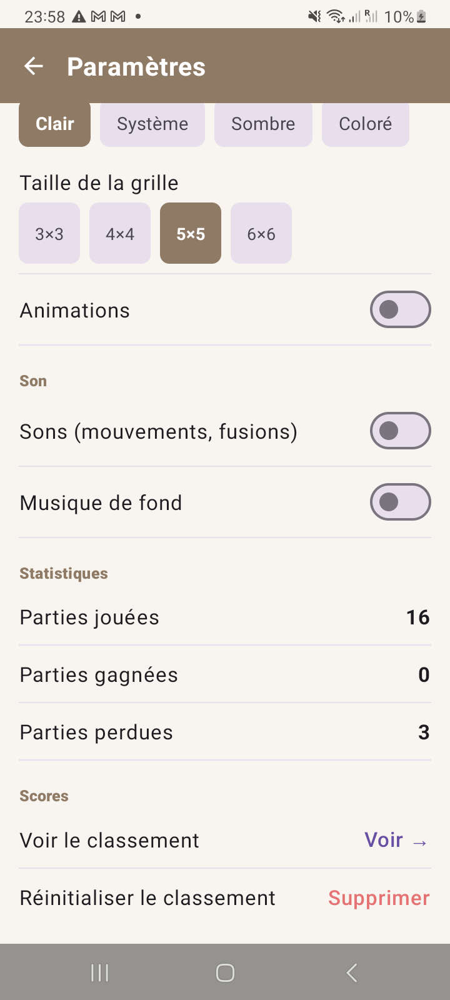
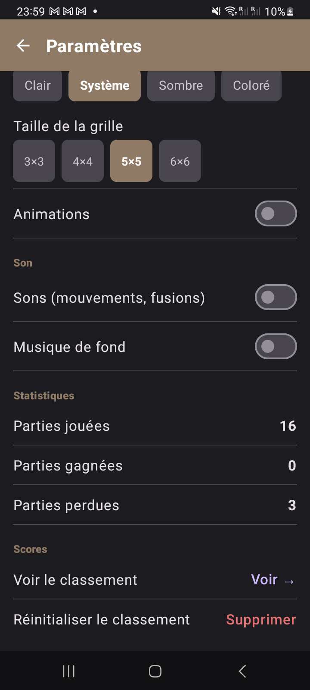

# Guide Complet du Jeu 2048 — Application Android

> **Aperçu de l'application**
>
> | Thème Clair | Thème Sombre | Thème Coloré |
> |:-----------:|:------------:|:------------:|
> |  |  |  |

## Sommaire

1. [Principe du jeu](#1-principe-du-jeu)
2. [Objectif et conditions de victoire](#2-objectif-et-conditions-de-victoire)
3. [Condition de défaite](#3-condition-de-défaite)
4. [La grille — Fonctionnement détaillé](#4-la-grille--fonctionnement-détaillé)
5. [Les déplacements — Comment ça marche](#5-les-déplacements--comment-ça-marche)
6. [La fusion des tuiles — Règles exactes](#6-la-fusion-des-tuiles--règles-exactes)
7. [Apparition des nouvelles tuiles](#7-apparition-des-nouvelles-tuiles)
8. [Calcul du score](#8-calcul-du-score)
9. [Annuler un coup (Undo)](#9-annuler-un-coup-undo)
10. [Tailles de grille disponibles](#10-tailles-de-grille-disponibles)
11. [Commandes — Comment jouer](#11-commandes--comment-jouer)
12. [Retour visuel — Surbrillance](#12-retour-visuel--surbrillance)
13. [Sons](#13-sons)
14. [Thèmes disponibles](#14-thèmes-disponibles)
15. [Animations](#15-animations)
16. [Paramètres disponibles](#16-paramètres-disponibles)
17. [Sauvegarde automatique](#17-sauvegarde-automatique)
18. [Tableau des scores (classement)](#18-tableau-des-scores-classement)
19. [Statistiques](#19-statistiques)
20. [Partage du score](#20-partage-du-score)
21. [Tutoriel intégré](#21-tutoriel-intégré)
22. [Stratégies pour gagner](#22-stratégies-pour-gagner)
23. [Valeurs possibles des tuiles](#23-valeurs-possibles-des-tuiles)

---

## 1. Principe du jeu

2048 est un jeu de puzzle à glissement sur une grille carrée. Le joueur fait glisser des tuiles numérotées dans quatre directions (haut, bas, gauche, droite). Quand deux tuiles portant le **même nombre** se rencontrent, elles **fusionnent** en une seule tuile portant la **somme des deux**.

Le jeu est né en mars 2014, créé par Gabriele Cirulli.

---

## 2. Objectif et conditions de victoire

**Objectif principal :** Créer une tuile portant la valeur **2048**.

Dès qu'une tuile 2048 apparaît sur la grille, une boîte de dialogue s'affiche :

```
╔══════════════════════════════╗
║    ✨ Vous avez gagné ! ✨   ║
║ Vous avez atteint la tuile   ║
║ 2048. Continuer ou nouvelle  ║
║ partie ?                     ║
║  [Continuer]  [Nouvelle partie] ║
╚══════════════════════════════╝
```

- **Continuer** — La partie continue, le joueur peut viser 4096, 8192, etc.
- **Nouvelle partie** — La grille est réinitialisée.

> ⚠️ La victoire n'est signalée qu'**une seule fois** par partie. Si le joueur clique "Continuer", la condition de victoire est marquée comme acceptée et ne se déclenchera plus.

---

## 3. Condition de défaite

La partie est **terminée (Game Over)** lorsque :
1. La grille est **complètement remplie** (aucune case vide).
2. **Aucun mouvement n'est possible** (aucun voisin horizontal ou vertical n'a la même valeur).

L'application vérifie ces deux conditions après **chaque déplacement** :

```
canMove() = il existe au moins une case vide
          OU deux cases voisines ont la même valeur
```

Dès que `canMove()` retourne `false`, la boîte de dialogue Game Over s'affiche :

```
╔══════════════════════════════╗
║       ❌ Game Over           ║
║ Plus aucun mouvement         ║
║ possible.                    ║
║  [Réessayer]  [Partager]     ║
╚══════════════════════════════╝
```

---

## 4. La grille — Fonctionnement détaillé

### Structure

La grille est un tableau **NxN** de cellules, chacune pouvant contenir :
- `0` → case VIDE
- `2, 4, 8, 16, 32, 64, 128, 256, 512, 1024, 2048, 4096...` → tuile numérotée

### Taille par défaut

La taille par défaut est **4×4** (16 cellules), mais le joueur peut choisir de 3×3 à 6×6.

### État initial

Au démarrage d'une nouvelle partie, la grille est entièrement vide, puis **deux tuiles** sont placées aléatoirement (chacune valant 2 ou 4).

### Exemple de grille 4×4

```
┌────┬────┬────┬────┐
│    │    │  2 │    │
├────┼────┼────┼────┤
│    │  4 │    │    │
├────┼────┼────┼────┤
│  2 │    │    │    │
├────┼────┼────┼────┤
│    │    │  4 │    │
└────┴────┴────┴────┘
```

---

## 5. Les déplacements — Comment ça marche

Quand le joueur effectue un déplacement (ex. : **gauche**) :

1. Chaque **ligne** est traitée indépendamment.
2. Toutes les tuiles de la ligne "glissent" vers la **gauche**.
3. Les cases vides se remplissent avec les tuiles déplacées.
4. Les fusions ont lieu (voir section 6).

### Exemple — Déplacement vers la GAUCHE

```
Avant :   [ 0 | 2 | 0 | 2 ]
Après :   [ 4 | 0 | 0 | 0 ]
```

Les deux `2` glissent à gauche et fusionnent en `4`.

```
Avant :   [ 2 | 0 | 2 | 4 ]
Après :   [ 4 | 4 | 0 | 0 ]
```

Les deux `2` fusionnent en `4`, le `4` glisse à gauche.

### Exemple — Déplacement vers le HAUT

Pour un déplacement vertical, chaque **colonne** est traitée indépendamment :

```
Avant :          Après :
┌─┬─┬─┬─┐       ┌─┬─┬─┬─┐
│ │ │ │ │       │2│4│ │ │
│2│4│ │ │  →    │ │ │ │ │
│ │ │ │ │       │ │ │ │ │
└─┴─┴─┴─┘       └─┴─┴─┴─┘
```

---

## 6. La fusion des tuiles — Règles exactes

### Règle fondamentale

> **Deux tuiles de même valeur fusionnent en une tuile valant leur somme.**

### Règle anti-double fusion

Une tuile **ne peut fusionner qu'une seule fois par déplacement**. Exemple :

```
Avant :   [ 2 | 2 | 2 | 2 ]
Après :   [ 4 | 4 | 0 | 0 ]
```

Les deux paires fusionnent séparément. Le résultat n'est PAS `[8|0|0|0]`.

### Règle de priorité

La fusion se fait **dans le sens du déplacement**. Pour un déplacement vers la gauche, les tuiles les plus à gauche fusionnent en premier :

```
Avant :   [ 4 | 2 | 2 | 0 ]
Après :   [ 4 | 4 | 0 | 0 ]   ← les deux 2 fusionnent, le 4 de gauche reste intact
```

### Implémentation dans le code (algorithme `mergeLine`)

```
1. Parcourir la ligne de gauche à droite
2. Ignorer toutes les cases vides (zéros)
3. Pour chaque valeur v :
   - Si la dernière valeur ajoutée au résultat == v et n'a pas encore fusionné :
       → Doubler : résultat[dernière] = v * 2, marquer comme fusionnée
   - Sinon :
       → Ajouter v à la suite du résultat
4. Retourner le nouveau tableau (zéros à droite)
```

---

## 7. Apparition des nouvelles tuiles

Après **chaque déplacement réussi** (c'est-à-dire si au moins une tuile a bougé), une nouvelle tuile est ajoutée sur la grille :

- **Valeur :** `2` avec une probabilité de **90%**, `4` avec une probabilité de **10%**.
- **Position :** choisie **aléatoirement** parmi toutes les cases vides.

> Si le déplacement n'a rien changé (aucune tuile n'a bougé), **aucune nouvelle tuile n'est ajoutée** et le coup n'est pas enregistré dans l'historique undo.

---

## 8. Calcul du score

Le score augmente **à chaque fusion** :

> `score += valeur_de_la_tuile_résultante`

### Exemples

| Fusion | Gain de score |
|--------|--------------|
| 2 + 2 → 4 | +4 |
| 4 + 4 → 8 | +8 |
| 16 + 16 → 32 | +32 |
| 1024 + 1024 → 2048 | +2048 |

Le **meilleur score** (BEST) est le score le plus élevé atteint depuis le début de la session. Il est sauvegardé automatiquement.

Le **SCORE** retombe à 0 à chaque nouvelle partie. Le **BEST** ne diminue jamais.

---

## 9. Annuler un coup (Undo)

Le bouton **↩** (dans le header) annule le dernier coup joué.

### Fonctionnement

- Avant chaque déplacement, l'état complet de la grille et le score sont sauvegardés dans un historique.
- L'historique conserve jusqu'aux **10 derniers coups**.
- Appuyer sur ↩ restaure le dernier état sauvegardé.
- Le bouton ↩ n'est visible que si un historique est disponible.

> ⚠️ L'annulation n'est pas possible si aucun coup n'a encore été joué ou si l'historique est vide.

---

## 10. Tailles de grille disponibles

| Taille | Cases | Difficulté | Tuile cible |
|--------|-------|-----------|------------|
| 3×3 | 9 | 🔴 Très difficile | 2048 (serré) |
| 4×4 | 16 | 🟡 Standard (classique) | 2048 |
| 5×5 | 25 | 🟢 Plus facile | 2048 (espace généreux) |
| 6×6 | 36 | 🟢 Très facile | 2048+ |

La taille se change dans **Paramètres → Taille de la grille**. Un changement de taille démarre automatiquement une **nouvelle partie**.

---

## 11. Commandes — Comment jouer

### Geste tactile (méthode principale)

| Geste | Action |
|-------|--------|
| Glisser vers la gauche ← | Déplacer toutes les tuiles à gauche |
| Glisser vers la droite → | Déplacer toutes les tuiles à droite |
| Glisser vers le haut ↑ | Déplacer toutes les tuiles vers le haut |
| Glisser vers le bas ↓ | Déplacer toutes les tuiles vers le bas |

Le seuil de détection du glissement est de **40 pixels**. En deçà, le geste est ignoré.

### Boutons flèches (méthode alternative)

En bas de l'écran, 4 boutons circulaires correspondant aux 4 directions sont disponibles :
```
         [  ↑  ]
[ ← ]          [ → ]
         [  ↓  ]
```

Ces boutons s'illuminent (changement de couleur) au moment du clic pour confirmer l'action.

> **Exemple — boutons flèches illuminés après appui (thème coloré)**
>
> 


### Boutons du header

| Bouton | Action |
|--------|--------|
| ⭐ | Ouvrir le classement des scores |
| ⚙️ | Ouvrir les paramètres |
| ↩ | Annuler le dernier coup |
| 🔄 | Démarrer une nouvelle partie |

---

## 12. Retour visuel — Surbrillance

### Pendant un glissement tactile

- Dès que le doigt commence à glisser horizontalement, la **ligne exacte** sous le doigt s'illumine en **jaune-or translucide**.
- Dès que le doigt commence à glisser verticalement, la **colonne exacte** sous le doigt s'illumine en **jaune-or translucide**.
- Quand le doigt se lève, la surbrillance disparaît immédiatement.

> **Capture — Surbrillance de ligne pendant un glissement (ligne 2 en jaune)**
>
> 


### Après un appui sur un bouton flèche

- Les **toutes les lignes** s'illuminent brièvement (pour ← ou →).
- Les **toutes les colonnes** s'illuminent brièvement (pour ↑ ou ↓).
- La surbrillance dure **400ms** puis disparaît automatiquement.

### Bouton flèche actif

Le bouton flèche cliqué change de couleur de fond (fond primaire du thème) pendant 400ms, signalant clairement quelle direction a été choisie.

---

## 13. Sons

| Son | Moment | Fichier |
|-----|--------|---------|
| 🔊 Déplacement | À chaque mouvement de tuile | `move.mp3` |
| 🔔 Fusion | Quand deux tuiles fusionnent | `move.mp3` (tempo légèrement plus rapide) |
| 🎵 Musique de fond | En continu (si activée) | `bg_music.mp3` (boucle) |

Tous les sons sont **désactivables indépendamment** dans les Paramètres :
- **Sons (mouvements, fusions)** — active/désactive les effets sonores.
- **Musique de fond** — active/désactive la musique en boucle.

---

## 14. Thèmes disponibles

| Thème | Description |
|-------|-------------|
| **Clair** | Fond blanc/beige, tuiles beige/orangé, style original du jeu 2048 |
| **Système** | Suit automatiquement les préférences de l'OS (clair le jour, sombre la nuit) |
| **Sombre** | Fond bleu nuit, tuiles indigo et violettes vibrantes |
| **Coloré** | Palette pastel colorée sur fond clair |

Le thème est changeable à tout moment dans **Paramètres → Thème**. Le changement est appliqué immédiatement.

---

## 15. Animations

Quand les animations sont activées (**Paramètres → Animations**) :

- La **couleur des tuiles** change en douceur lors d'une fusion (transition de 150ms).
- Les **boutons flèches** s'animent (transition de couleur en 200ms).
- La **surbrillance de ligne/colonne** apparaît/disparaît progressivement.

Quand les animations sont désactivées, les changements sont instantanés (mode performance).

---

## 16. Paramètres disponibles

Accès : bouton ⚙️ dans le header ou via la navigation.

| Paramètre | Type | Options |
|-----------|------|---------|
| Thème | Sélecteur | Clair / Système / Sombre / Coloré |
| Taille de la grille | Sélecteur | 3×3 / 4×4 / 5×5 / 6×6 |
| Animations | Switch | Activé / Désactivé |
| Sons (mouvements, fusions) | Switch | Activé / Désactivé |
| Musique de fond | Switch | Activé / Désactivé |
| Règles du jeu | Lien | Ouvre le tutoriel |
| Voir le classement | Lien | Ouvre l'écran des scores |
| Réinitialiser le classement | Action | Supprime tous les scores enregistrés |

> **Captures — Écran Paramètres (haut et bas) en thème Clair et Sombre**
>
> | Thème Clair | Thème Sombre | Thème Coloré |
> |:-----------:|:------------:|:------------:|
> |  |  |  |
> |  |  | |


---

## 17. Sauvegarde automatique

L'application sauvegarde automatiquement l'état de la partie lorsque l'application passe en arrière-plan (événement `ON_PAUSE`).

**Ce qui est sauvegardé :**
- La grille entière (taille + valeur de chaque cellule)
- Le score courant
- Le meilleur score
- L'état "victoire" (si le joueur a déjà atteint 2048)

**Ce qui est sauvegardé dans les Paramètres :**
- Thème sélectionné
- Taille de grille préférée
- Préférences sons et musique
- Animations activées/désactivées
- Statistiques de jeu

À la réouverture de l'application, la partie en cours est automatiquement restaurée.

---

## 18. Tableau des scores (classement)

Accès : bouton ⭐ dans le header ou **Paramètres → Voir le classement**.

Chaque score est enregistré avec :
- La **valeur du score** (entier)
- La **date** de la partie (format `jj/mm/aaaa`)

Le classement affiche les scores triés **du plus grand au plus petit**.

Les 3 premiers sont distingués par des médailles :
- 🥇 **#1** — fond doré
- 🥈 **#2** — fond argent
- 🥉 **#3** — fond bronze

Les scores sont persistants — ils survivent à la fermeture complète de l'application.

**Réinitialiser** : **Paramètres → Réinitialiser le classement** supprime tous les scores enregistrés.

> **Captures — Écran Classement**
>
> | Thème Clair | Thème Sombre |
> |:-----------:|:------------:|
> |  |  |


---

## 19. Statistiques

Disponibles dans **Paramètres → Statistiques** :

| Statistique | Description |
|------------|-------------|
| Parties jouées | Nombre total de nouvelles parties lancées |
| Parties gagnées | Nombre de fois où la tuile 2048 a été atteinte |
| Parties perdues | Nombre de fois où Game Over a été déclenché |

---

## 20. Partage du score

Lorsque la boîte de dialogue Game Over s'affiche, le bouton **"Partager le score"** ouvre le sélecteur de partage Android natif.

Le message partagé contient le score final de la partie. Cette fonctionnalité utilise `Intent.ACTION_SEND`.

---

## 21. Tutoriel intégré

Accès : **Paramètres → Règles du jeu (tutoriel)** → bouton **Voir →**.

Une boîte de dialogue s'affiche avec les règles essentielles du jeu :
- Principe du glissement
- Objectif (atteindre 2048)
- Règle de fusion

> **Captures — Tutoriel en 3 thèmes**
>
> | Thème Clair | Thème Sombre | Thème Coloré |
> |:-----------:|:------------:|:------------:|
> |  |  |  |


---

## 22. Stratégies pour gagner

### 1. Coin préférentiel (méthode classique)
Garder toujours la tuile la plus élevée dans un **coin fixe** (ex. : coin bas-gauche). Ne jamais déplacer dans la direction qui sortirait la tuile de ce coin.

### 2. Serpent (Snake)
Remplir la grille en "serpent" : la ligne du bas va de gauche à droite, la ligne au-dessus va de droite à gauche, etc. Cela maximise les fusions successives.

```
→ → → →
← ← ← ←
→ → → →
↑ (monter quand plein)
```

### 3. Ne jamais déplacer vers le haut

Beaucoup de joueurs recommandent d'éviter au maximum les déplacements vers le **haut** pour conserver la structure de la grille dans les coins bas.

### 4. Grille plus grande = plus facile

Si vous avez du mal en 4×4, passer en 5×5 ou 6×6 donne beaucoup plus d'espace et facilite grandement l'atteinte de 2048.

---

## 23. Valeurs possibles des tuiles

La séquence des valeurs possibles est une suite de **puissances de 2** :

```
2 → 4 → 8 → 16 → 32 → 64 → 128 → 256 → 512 → 1024 → 2048 → 4096 → 8192...
```

En théorie, il n'y a pas de limite supérieure — le jeu continue au-delà de 2048 si le joueur clique "Continuer".

La tuile maximale théoriquement atteignable dépend de la taille de la grille :
- **3×3** : environ 2048 (très difficile)
- **4×4** : 131 072 (théorique, jamais atteint en pratique)
- **5×5 / 6×6** : encore plus élevé

---

*Fichier généré automatiquement — Projet 2048 Android — 2025/2026*
